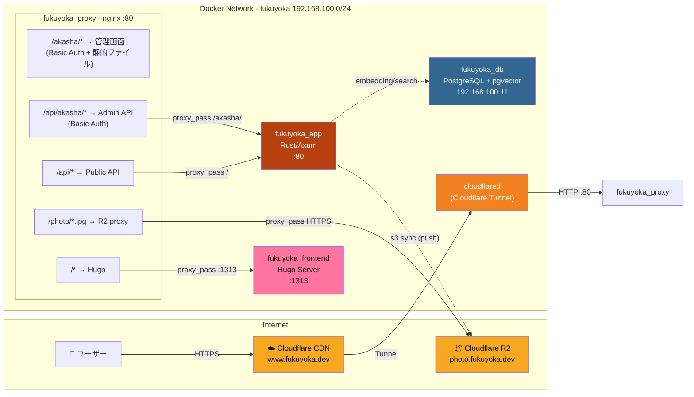

# rustを用いた食事記録ブログサイトの構築
## 目的
- 食事記録を投稿。(instagramみたいに)
- RustでAPI
- cloudflare tunnelを用いたセルフホスティング

## 起動手順
`template.env`から`.env`を作成。
```sh
make build 
make up
```
でAPIの起動ができます。

起動するコンテナは全部で4つ。
1. cloudflare tunnel : cloudflare経由でインターネット接続
2. nginx : basic認証や`photo.fukuyoka.dev`へのプロキシなど
3. hugo(Frontend描画) : 記事(html)の描画
4. api(Rust) : 検索APIの提供(adminのAPIも共用)

# Fukuyoka ネットワーク構成図



## ポート一覧

| サービス | ポート | 用途 |
|---------|-------|------|
| fukuyoka_proxy (nginx) | 80 | エントリポイント |
| fukuyoka_proxy (nginx) | 51841 | ヘルスチェック (dev時は外部公開) |
| fukuyoka_proxy (nginx) | 11301 | www.fukuyoka.dev へリダイレクト |
| fukuyoka_app (Rust) | 80 | API サーバー |
| fukuyoka_frontend (Hugo) | 1313 | Hugo dev server |
| fukuyoka_db (PostgreSQL) | 5432 | データベース |

## ルーティング詳細

| パス | 認証 | 転送先 | 説明 |
|------|------|--------|------|
| `/akasha/*` | Basic Auth | 静的ファイル (`/var/www/admin/`) | 管理画面 |
| `/api/akasha/*` | Basic Auth | `fukuyoka_app /akasha/` | 管理API (画像アップロード等) |
| `/api/*` | なし | `fukuyoka_app /` | 公開API (embedding, search) |
| `/photo/*.{png,jpg}` | なし | `photo.fukuyoka.dev` (R2) | 画像プロキシ |
| `/*` | なし | `fukuyoka_frontend:1313` | ブログフロントエンド |
| `/wp-*` 等 | - | 418 I'm a teapot | 攻撃パスブロック |
